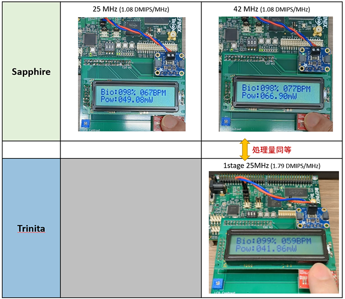

# Trinita 1stage/2stage SpO2 Demo Design

## 注意

- **本ソースコードの使用にあたり [ライセンス](./LICENSE) に同意頂く必要がございます。**
  - 本リポジトリの一部または全部を Clone / Download した時点で、ライセンス条項に同意したものとみなします。
- この Demo Design で使用している Trinita Core については [こちら](https://github.com/unolabo/efx-trinita-exa) を参照ください。

## 概要

- Efinix 向け 1stage/2stage Trinita Core を使ったデモデザインです。
- T20 BGA256 Development Board に結合する拡張ボードに下記のパーツが実装されています。
  - これらのパーツを Trinita Core から制御します。

| 部品  | 型番   |
| ------ | ------ |
| 16桁 2行キャラクタ LCD 3.3V バックライト付き  | 秋月電子 SC1602BSLB-XA-LB-G |
| Current Monitor IC     | スイッチサイエンス INA219搭載 STEMMA QT互換 ハイサイドDCセンサ |
| SpO2 Monitor IC        | SparkFun SEN-15219 |

- Current Monitor では、T20 FPGA の Core 電流を測定します。
- SpO2 Monitor では、心拍数 / SpO2 濃度を測定します。
- キャラクタ LCD には、それぞれの Monitor で測定したデータを表示します。

## 実行結果

**※補足**

Sapphire 42 MHz は Trinita 1stage 25 MHz と同等の処理量、Sapphire 38.4 MHz は Trinita 2stage 25 MHz と同等の処理量です。いずれも Trinita の方が電力効率が高い結果となっています。

- LCD 表示内容
  - Bio : 飽和酸素濃度, 心拍数
  - Pow : 消費電力
- 1 stage は DMIPS/MHz が高く、Sapphire より処理量(待機処理) が多いため、消費電力も大きくなります
- 1 stage は、動作周波数を下げることで、Sapphire と同等の性能を保ちながら、消費電力を下げることが可能です。

## サンプルプロジェクト

| フォルダ | 内容  |
| ------ | ------ |
| [demo_1stage](./demo_1stage)  | 1 ステージ版デザイン |
| [demo_2stage](./demo_2stage)  | 2 ステージ版デザイン |

## 問い合わせ先

|   | リンク先 |
| ------ | ------ |
| Trinita IP コア 開発元・技術問い合わせ | [株式会社ウーノラボ ](https://www.unolabo.co.jp/) |
